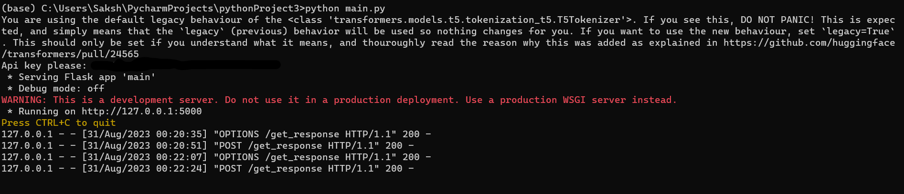
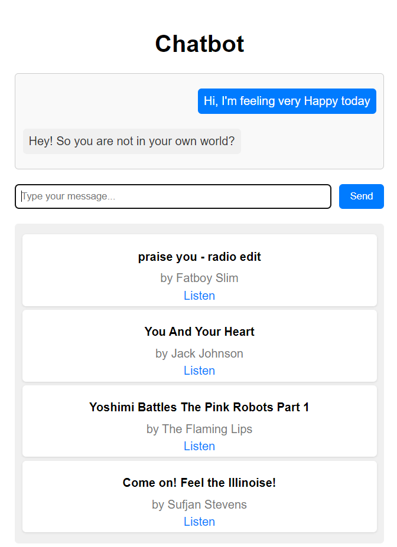
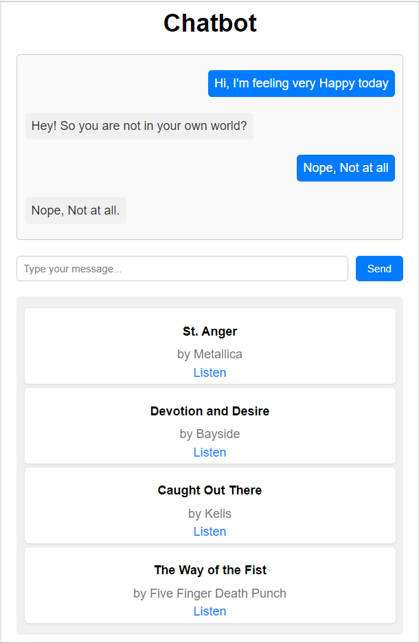

# Emotion-based Chatbot with Music Recommendation


This project is a chatbot demo for Music-Bot that can sense user emotions and generate responses that are aligned with the user's mood. It also uses the Last.fm API to suggest songs that match the user's feelings and display them along with the chat history. This project is built on a HuggingFace Transformers backend that performs the emotion recognition and dialogue generation, and a simple and lightweight js frontend that shows the chat interface and the music player. This demo is designed to run on low power devices, as the backend server does most of the computation. 
## How it works

The chatbot uses two state-of-the-art models from Hugging Face: [mrm8488/t5-base-finetuned-emotion](https://huggingface.co/mrm8488/t5-base-finetuned-emotion) and [microsoft/GODEL-v1_1-large-seq2seq](https://huggingface.co/microsoft/GODEL-v1_1-large-seq2seq). The former is a T5 model fine-tuned for emotion recognition, and the latter is a Seq2Seq model fine-tuned for open-domain dialogue generation. The chatbot first uses the T5 model to classify the user input into one of six emotions: joy, sadness, anger, fear, surprise, or neutral. Then, the Seq2Seq model is used to generate a response based on the emotion and the context of the conversation. Finally, Last.fm API is called to fetch the top songs for the detected emotion and display them in a HTML/CSS/JavaScript frontend.

## How to run

To run this project, you need to have Python 3.6 or higher installed on your system. You also need to install the required packages by running:

```bash
pip install -r requirements.txt
```
Also remember to get your [Last.fm](https://www.last.fm/api) api key, it will come in handy when firing up the server =)


Fire up the server and enter your API key when prompted
```bash
python main.py
```

open index.html in your browser and see the magic happen ;)







